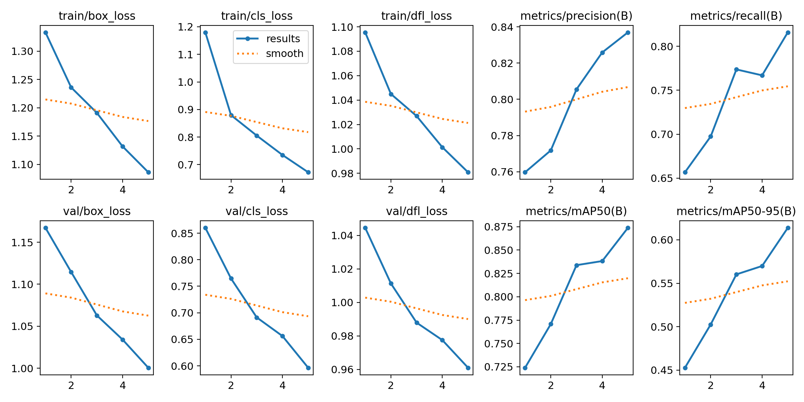

# 🚦 YOLOv5 Traffic Detection Model

This YOLOv5 model is trained on a custom traffic dataset to detect five key object classes:  
**bicycle, bus, car, motorbike, and person**.

It is optimized for **real-time detection in urban environments**, and can be used in applications such as:
- 🚗 Traffic monitoring
- 🌆 Smart city infrastructure
- 🚙 Autonomous driving systems

## 📸results of training

> Note: The image above shows results from the training of the model.
